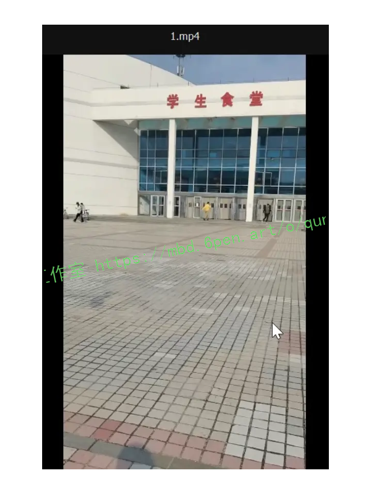
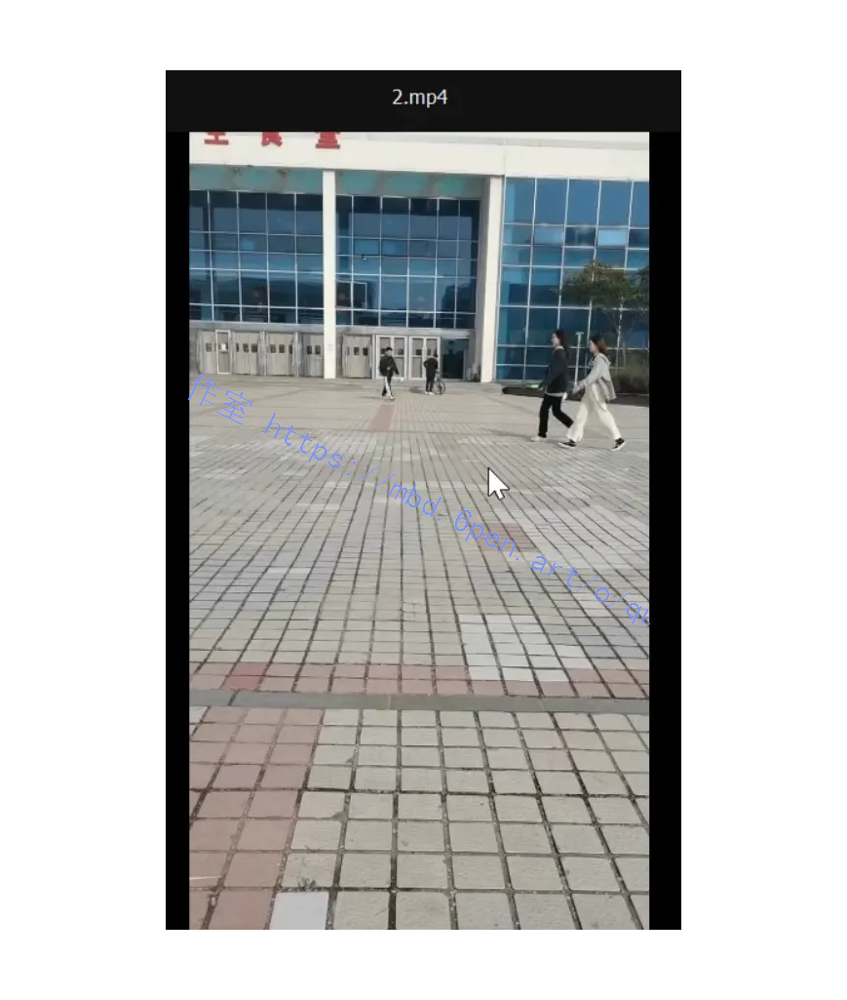
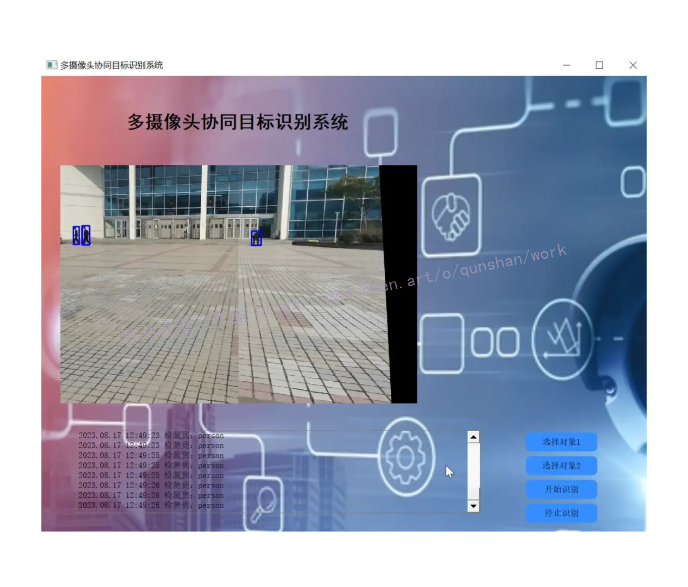
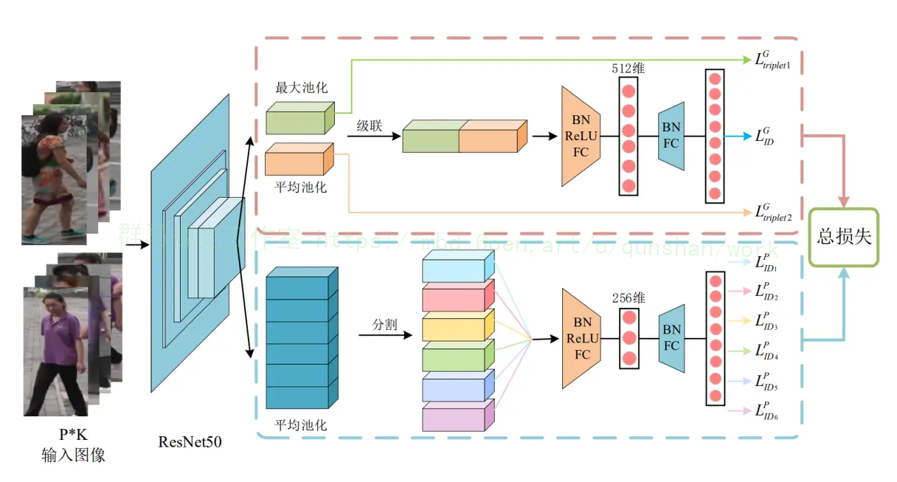
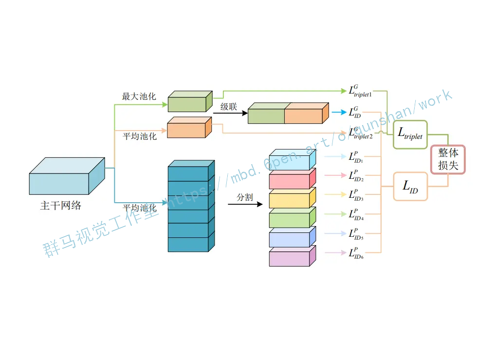
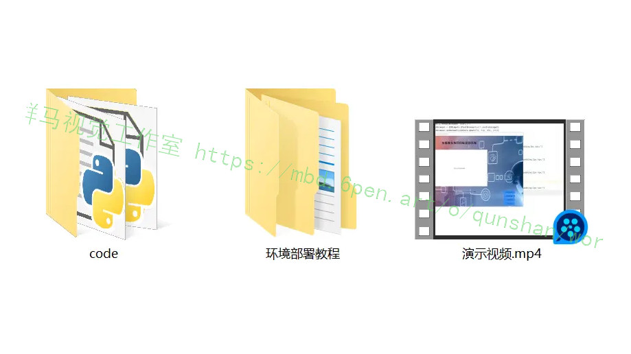


# 1.研究背景与意义


随着计算机视觉和图像处理技术的快速发展，人们对于多摄像头拼接行人检测系统的需求日益增加。这种系统可以利用多个摄像头的视角，实时监测和跟踪行人的活动，为公共安全、交通管理、视频监控等领域提供重要的支持和帮助。

在传统的行人检测系统中，通常只使用单个摄像头进行监测，这种方法存在一些局限性。首先，单个摄像头的视野有限，无法全面覆盖监测区域，导致行人漏检的情况较为常见。其次，由于单个摄像头的视角固定，行人在摄像头视野之外的区域无法被检测到，这给行人的追踪和监测带来了困难。此外，由于摄像头的位置和角度不同，行人在不同摄像头下的外观和姿态也会发生变化，增加了行人检测和跟踪的难度。

为了解决以上问题，基于OpenCV和ORB的多摄像头拼接行人检测系统应运而生。OpenCV是一个开源的计算机视觉库，提供了丰富的图像处理和计算机视觉算法，可以方便地进行图像的处理、特征提取和目标检测等操作。ORB（Oriented FAST and Rotated BRIEF）是一种快速的特征提取和匹配算法，具有旋转不变性和尺度不变性，适用于多摄像头拼接行人检测系统中的特征匹配和跟踪。

多摄像头拼接行人检测系统的意义在于提高行人检测的准确性和鲁棒性。通过利用多个摄像头的视角，可以全面覆盖监测区域，减少行人漏检的情况，提高检测的召回率。同时，多摄像头的布局可以使得行人在不同摄像头下的外观和姿态变化更加明显，从而提高行人检测和跟踪的准确性。此外，多摄像头拼接行人检测系统还可以实现行人的实时跟踪和轨迹分析，为公共安全和交通管理等领域提供更加全面和精确的数据支持。

总之，基于OpenCV和ORB的多摄像头拼接行人检测系统具有重要的研究意义和应用价值。通过充分利用多个摄像头的视角和特征提取算法，可以提高行人检测的准确性和鲁棒性，为公共安全和交通管理等领域提供更加全面和精确的数据支持。相信随着技术的不断进步和应用的推广，多摄像头拼接行人检测系统将在实际应用中发挥越来越重要的作用。

# 2.图片演示







# 3.视频演示

# 4.网络结构设计
在目前的行人识别研究中，提取的特征主要分为两种:全局特征和局部特征。全局特征通过提取整张行人图像的特征信息，来整体的对行人的外观进行描述。这种方法虽然十分简单并易于训练，但是在复杂的现实环境中，由于缺失细粒度特征，就会导致模型对外观相似度较高的难样本分辨能力过差。而使用行人的局部特征就可以将网络的注意力放在行人身体的部分特殊区域上，如帽子，背包等特征明显的部分。通过过滤掉行人区域外的繁杂信息的干扰，就可以学习到更具有判别力的局部细节特征，从而更好的反应难样本之间的细节差异，从而实现更好的识别效果。但是仅使用局部特征的话也会忽视行人图像的整体全局特征，而且在实际的训练中会产生特征丢失的现象，一定程度上影响网络的性能。

因此，参考该博客的代码，本文提出了一种多分支特征融合的网络结构，该网络可以将局部特征信息与全局特征信息相结合，弥补各自的缺陷。局部特征的加入可以帮助网络分辨出行人之间只靠全局特征分辨不出的微小差异，而全局特征的应用可以一定程度上缓解仅使用局部特征所造成的特征丢失的现象。该模型具有两个分支，一个是全局特征分支用于学习行人图像的全局特征，另一个是采用水平切条方式来获取行人局部特征的局部特征分支，这两个分支共享一个基于ResNet-50的主干网络。通过两种不同类型的行人图像特征的合理组合，可以为模型带来更优的识别精度。同时网络结合交叉嫡损失和三元组损失进行训练，来得到一个端到端的行人识别任务的特征提取网络。



### 4.1.主干网络
主干网络主要用来对行人图像进行特征提取，然后将提取出的特征图分别输出到后面的局部和全局分支中去。ResNet-50在许多计算机视觉系统中表现出了很强的竞争力，并被广泛用作行人识别系统中。因此本文也选择ResNet-50作为该行人重识别模型的主干网络,并加载其在ImageNet上的预训练的网络参数。但是为了行人识别任务的需要，需要对其网络结构做出一些修改。主要是移除了其原结构中的最后一个全连接层，并增加降维模块和分类层进行多损失训练;
由于高空间分辨率可以丰富特征的粒度，所有删除了res_conv5_1块中的最后一个下采样层(down-sample);同时将最后一个卷积层的步长从2更改为1，以获得具有更高空间分辨率的特征图。例如，输入一张分辨率256×128的图片，如果其步长为2，经过网络处理后只能得到一张分辨率为8×4的特征图，而如果将其步长改为1，就能得到一个分辨率为16×8的特征图。在接下来的所有实验中，输入图像的大小总为288×144，当步长为1时，输出特征图的空间大小总为18×9。要说明的是，这个操作只增加了很小的计算成本，且没有引入其他的训练参数，但特征图空间分辨率的提高却能带来性能的提高。

### 4.2 全局特征分支
参考该博客代码的方案，在全局特征分支被设置在主干网络之后用于学习行人图像的全局特征。它将主干网络输出的特征图作为输入，其尺寸为[1，2048,18,9]。其中第一个数字1代表输入图像的数量;第二个数字2048代表的是输入的特征图的通道总数;第三位数字18和第四位数字9即为输入特征图的高度和宽度。在获得前置主干网络的输入后,分别用一个输出尺寸为1×1的全局最大池化GMP和一个输出尺寸同样为1x1的全局平均池化GAP去对输入的特征图进行池化操作,得到两个尺寸为[1,2048,1,1]的特征图.然后分别对这两个特征图进行降维操作后输出两个2048维的特征向量，并分别使用两个不同的三元组损失函数对其进行训练。同时将这两个2048维的特征向量级联(Concatenate)起来得到一个4096维的特征向量，再连接一个BN层、LeakyReLU层、输出维度为512的全连接层、第二个BN层后，最后连接一个输出维度为行人数目的全连接层，并对该输出使用一个交叉嫡损失函数进行训练。
### 4.3 局部特征分支
为了学习行人图像的局部特征描述(Local Feature Representations)来提高网络模型重识别的能力，设计了该局部特征分支。不同与上面的全局特征分支用两个尺寸为1x1的池化层进行池化操作，在局部特征分支中仅使用一个输出尺寸为6×1的全局平均池化GAP来对主干网络输出的特征图进行池化操作。池化操作后会得到一个尺寸为[1,2048,6,1]的特征图，然后对其第三个维度进行分割，可以得到6个不同的尺寸为[1,2048,1,1]特征图。相当于将一张行人图像水平划分为6块，拆分后的每一个特征图分别对应其中的一块。然后对上面的6个特征图进行降维操作,得到6个2048维的特征向量。同样的将这6个特征向量分别连接一个BN层、LeakyReLU层、256维的全连接层、第二个BN层，一个维度为行人ID数的全连接层，最后使用6个交叉嫡损失函数分别对6个输出进行训练。



# 5.核心代码讲解

#### 5.1 match.py

```python

class ImageStitcher:
    def __init__(self, src, des):
        self.src = src
        self.des = des
        self.GOOD_POINTS_LIMITED = 0.99

    def stitch_images(self):
        img1_3 = cv.imread(self.src, 1)  # 基准图像
        img2_3 = cv.imread(self.des, 1)  # 拼接图像

        orb = cv.ORB_create()
        kp1, des1 = orb.detectAndCompute(img1_3, None)
        kp2, des2 = orb.detectAndCompute(img2_3, None)

        bf = cv.BFMatcher.create()

        matches = bf.match(des1, des2)

        matches = sorted(matches, key=lambda x: x.distance)

        goodPoints = []
        for i in range(len(matches) - 1):
            if matches[i].distance < self.GOOD_POINTS_LIMITED * matches[i + 1].distance:
                goodPoints.append(matches[i])

        src_pts = np.float32([kp1[m.queryIdx].pt for m in goodPoints]).reshape(-1, 1, 2)
        dst_pts = np.float32([kp2[m.trainIdx].pt for m in goodPoints]).reshape(-1, 1, 2)

        M, mask = cv.findHomography(dst_pts, src_pts, cv.RHO)

        h1, w1, p1 = img2_3.shape
        h2, w2, p2 = img1_3.shape

        h = np.maximum(h1, h2)
        w = np.maximum(w1, w2)
        ...
        ...
        dst = cv.add(dst1, imageTransform)
        dst_no = np.copy(dst)

        dst_target = np.maximum(dst1, imageTransform)

        return dst_target
```

这个程序文件名为match.py，主要功能是进行图像匹配和拼接。程序的大致流程如下：

1. 导入所需的库：numpy、cv2、matplotlib等。
2. 定义了一个常量GOOD_POINTS_LIMITED，用于筛选匹配点。
3. 读取两张图像作为基准图像和拼接图像。
4. 使用ORB算法检测并计算图像的特征点和特征描述符。
5. 创建一个暴力匹配器bf，并使用它对两张图像的特征描述符进行匹配。
6. 对匹配结果进行排序，并筛选出距离较近的好的匹配点。
7. 使用cv.drawMatches函数绘制匹配结果图像。
8. 提取好的匹配点的坐标，用于计算透视变换矩阵。
9. 使用cv.findHomography函数计算透视变换矩阵M。
10. 获取原图像的高和宽，并计算拼接后图像的大小。
11. 使用cv.warpPerspective函数对拼接图像进行透视变换。
12. 使用cv.warpAffine函数对基准图像进行仿射变换。
13. 将两张变换后的图像进行叠加，得到最终的拼接结果。
14. 使用matplotlib库绘制图像，并保存结果图像。
15. 显示拼接结果图像，并等待用户按键退出。

总体来说，这个程序实现了图像匹配和拼接的功能，通过ORB算法检测图像的特征点和特征描述符，使用暴力匹配器进行匹配，筛选出好的匹配点，并利用透视变换和仿射变换将两张图像拼接在一起。最终将拼接结果保存并显示出来。

#### 5.2 sift.py

```python

class Stitcher:
    def __init__(self):
        global model
        model = ['ORB', 'SIFT', 'SURF', 'BRISK', 'AKAZE']
        # determine if we are using OpenCV v3.X
        self.isv3 = imutils.is_cv3()

    def stitch(self, images, ratio=0.75, reprojThresh=4.0,
               showMatches=False):
        (imageB, imageA) = images
        start = time.time()
        (kpsA, featuresA) = self.detectAndDescribe(imageA)
        end = time.time()
        print('%.5f s' % (end - start))

        (kpsB, featuresB) = self.detectAndDescribe(imageB)

        start = time.time()
        M = self.matchKeypoints(kpsA, kpsB,
                                featuresA, featuresB, ratio, reprojThresh)
        end = time.time()
        print('%.5f s' % (end - start))

        if M is None:
            return None


        if showMatches:
            start = time.time()
            vis = self.drawMatches(imageA, imageB, kpsA, kpsB, matches,
                                   status)
            end = time.time()
            print('%.5f s' % (end - start))
            return (result, vis)

        return result

    def detectAndDescribe(self, image):
        global model
        gray = cv2.cvtColor(image, cv2.COLOR_BGR2GRAY)

        if self.isv3:
            descriptor = cv2.xfeatures2d.SIFT_create()
            (kps, features) = descriptor.detectAndCompute(image, None)
        else:
            detector = cv2.FeatureDetector_create(model[0])
            kps = detector.detect(gray)

            extractor = cv2.DescriptorExtractor_create(model[0])
            (kps, features) = extractor.compute(gray, kps)

        kps = np.float32([kp.pt for kp in kps])

        return (kps, features)

    def matchKeypoints(self, kpsA, kpsB, featuresA, featuresB,
                       ratio, reprojThresh):
        matcher = cv2.DescriptorMatcher_create("BruteForce")
        rawMatches = matcher.knnMatch(featuresA, featuresB, 2)
        matches = []

        for m in rawMatches:
            if len(m) == 2 and m[0].distance < m[1].distance * ratio:
                matches.append((m[0].trainIdx, m[0].queryIdx))
        ...
        ...
        return None

    def drawMatches(self, imageA, imageB, kpsA, kpsB, matches, status):
        (hA, wA) = imageA.shape[:2]
        (hB, wB) = imageB.shape[:2]
        vis = np.zeros((max(hA, hB), wA + wB, 3), dtype="uint8")
        vis[0:hA, 0:wA] = imageA
        vis[0:hB, wA:] = imageB

        for ((trainIdx, queryIdx), s) in zip(matches, status):
            if s == 1:
                ptA = (int(kpsA[queryIdx][0]), int(kpsA[queryIdx][1]))
                ptB = (int(kpsB[trainIdx][0]) + wA, int(kpsB[trainIdx][1]))
                cv2.line(vis, ptA, ptB, (0, 255, 0), 1)

        return vis


```

该程序文件名为sift.py，是一个图像拼接的程序。程序通过使用SIFT算法来检测关键点和提取局部不变特征，并使用RANSAC算法进行特征匹配。程序中还包含了一个Stitcher类，该类包含了拼接图像的方法。程序还使用了OpenCV库来处理图像和视频。程序通过读取两个视频文件来获取图像，并将两个图像进行拼接。拼接的结果可以通过设置showMatches参数来显示两个图像特征的匹配情况。程序会不断循环读取视频帧并进行拼接，直到按下键盘上的q键退出程序。

#### 5.3 test.py

```python

class Stitcher:
    def __init__(self):
        self.isv3 = imutils.is_cv3()

    def stitch(self, images, ratio=0.75, reprojThresh=4.0, showMatches=False):
        (imageB, imageA) = images
        start = time.time()
        (kpsA, featuresA) = self.detectAndDescribe(imageA)
        end = time.time()
        print('%.5f s' % (end - start))

        (kpsB, featuresB) = self.detectAndDescribe(imageB)

        start = time.time()
        M = self.matchKeypoints(kpsA, kpsB, featuresA, featuresB, ratio, reprojThresh)
        end = time.time()
        print('%.5f s' % (end - start))

        if M is None:
            return None

        (matches, H, status) = M
        start = time.time()
        result = cv2.warpPerspective(imageA, H, (imageA.shape[1] + imageB.shape[1], imageA.shape[0]))
        result[0:imageB.shape[0], 0:imageB.shape[1]] = imageB
        end = time.time()
        print('%.5f s' % (end - start))

        if showMatches:
            start = time.time()
            vis = self.drawMatches(imageA, imageB, kpsA, kpsB, matches, status)
            end = time.time()
            print('%.5f s' % (end - start))
            return (result, vis)

        return result


    def matchKeypoints(self, kpsA, kpsB, featuresA, featuresB, ratio, reprojThresh):
        matcher = cv2.DescriptorMatcher_create("BruteForce")
        rawMatches = matcher.knnMatch(featuresA, featuresB, 2)
        matches = []

        for m in rawMatches:
            if len(m) == 2 and m[0].distance < m[1].distance * ratio:
                matches.append((m[0].trainIdx, m[0].queryIdx))

        if len(matches) > 4:
            ptsA = np.float32([kpsA[i] for (_, i) in matches])
            ptsB = np.float32([kpsB[i] for (i, _) in matches])

            (H, status) = cv2.findHomography(ptsA, ptsB, cv2.RANSAC, reprojThresh)

            return (matches, H, status)

        return None

    def drawMatches(self, imageA, imageB, kpsA, kpsB, matches, status):
        (hA, wA) = imageA.shape[:2]
        (hB, wB) = imageB.shape[:2]
        vis = np.zeros((max(hA, hB), wA + wB, 3), dtype="uint8")
        vis[0:hA, 0:wA] = imageA
        vis[0:hB, wA:] = imageB

        for ((trainIdx, queryIdx), s) in zip(matches, status):
            if s == 1:
                ptA = (int(kpsA[queryIdx][0]), int(kpsA[queryIdx][1]))
                ptB = (int(kpsB[trainIdx][0]) + wA, int(kpsB[trainIdx][1]))
                cv2.line(vis, ptA, ptB, (0, 255, 0), 1)

        return vis
```

这个程序文件是一个图像拼接的工具，可以将两张图像拼接成一张全景图。它使用了OpenCV库和imutils库来进行图像处理和特征提取。

程序中定义了一个Stitcher类，它包含了拼接图像的方法。在拼接方法中，首先会将输入的两张图像转换为灰度图像，然后使用SIFT算法检测关键点和提取局部不变特征。接下来，会对两张图像的特征进行匹配，使用RANSAC算法计算出两张图像之间的透视变换矩阵。最后，将第二张图像通过透视变换矩阵进行变换，然后将两张图像拼接在一起。

程序还提供了一些辅助方法，如绘制匹配的特征点和保存拼接结果的方法。

在程序的主函数中，首先加载两张图像，并调用Stitcher类的拼接方法将两张图像拼接在一起。如果设置了showMatches参数为True，则会返回拼接结果和绘制了匹配特征点的图像。最后，将拼接结果保存到文件中。

整个程序的运行时间会被打印出来，方便了解程序的性能。

#### 5.4 models\experimental.py

```python


class CrossConv(nn.Module):
    # Cross Convolution Downsample
    def __init__(self, c1, c2, k=3, s=1, g=1, e=1.0, shortcut=False):
        # ch_in, ch_out, kernel, stride, groups, expansion, shortcut
        super().__init__()
        c_ = int(c2 * e)  # hidden channels
        self.cv1 = Conv(c1, c_, (1, k), (1, s))
        self.cv2 = Conv(c_, c2, (k, 1), (s, 1), g=g)
        self.add = shortcut and c1 == c2

    def forward(self, x):
        return x + self.cv2(self.cv1(x)) if self.add else self.cv2(self.cv1(x))


class Sum(nn.Module):
    # Weighted sum of 2 or more layers https://arxiv.org/abs/1911.09070
    def __init__(self, n, weight=False):  # n: number of inputs
        super().__init__()
        self.weight = weight  # apply weights boolean
        self.iter = range(n - 1)  # iter object
        if weight:
            self.w = nn.Parameter(-torch.arange(1.0, n) / 2, requires_grad=True)  # layer weights

    def forward(self, x):
        y = x[0]  # no weight
        if self.weight:
            w = torch.sigmoid(self.w) * 2
            for i in self.iter:
                y = y + x[i + 1] * w[i]
        else:
            for i in self.iter:
                y = y + x[i + 1]
        return y


class MixConv2d(nn.Module):
    # Mixed Depth-wise Conv https://arxiv.org/abs/1907.09595
    def __init__(self, c1, c2, k=(1, 3), s=1, equal_ch=True):  # ch_in, ch_out, kernel, stride, ch_strategy
        super().__init__()
        n = len(k)  # number of convolutions
        if equal_ch:  # equal c_ per group
            i = torch.linspace(0, n - 1E-6, c2).floor()  # c2 indices
            c_ = [(i == g).sum() for g in range(n)]  # intermediate channels
        else:  # equal weight.numel() per group
            b = [c2] + [0] * n
            a = np.eye(n + 1, n, k=-1)
            a -= np.roll(a, 1, axis=1)
            a *= np.array(k) ** 2
            a[0] = 1
            c_ = np.linalg.lstsq(a, b, rcond=None)[0].round()  # solve for equal weight indices, ax = b

        self.m = nn.ModuleList(
            [nn.Conv2d(c1, int(c_), k, s, k // 2, groups=math.gcd(c1, int(c_)), bias=False) for k, c_ in zip(k, c_)])
        self.bn = nn.BatchNorm2d(c2)
        self.act = nn.SiLU()

    def forward(self, x):
        return self.act(self.bn(torch.cat([m(x) for m in self.m], 1)))


class Ensemble(nn.ModuleList):
    # Ensemble of models
    def __init__(self):
        super().__init__()

    def forward(self, x, augment=False, profile=False, visualize=False):
        y = []
        for module in self:
            y.append(module(x, augment, profile, visualize)[0])
        # y = torch.stack(y).max(0)[0]  # max ensemble
        # y = torch.stack(y).mean(0)  # mean ensemble
        y = torch.cat(y, 1)  # nms ensemble
        return y, None  # inference, train output


def attempt_load(weights, map_location=None, inplace=True, fuse=True):
    from models.yolo import Detect, Model

    # Loads an ensemble of models weights=[a,b,c] or a single model weights=[a] or weights=a
    model = Ensemble()
    for w in weights if isinstance(weights, list) else [weights]:
        ckpt = torch.load(attempt_download(w), map_location=map_location)  # load
        if fuse:
            model.append(ckpt['ema' if ckpt.get('ema') else 'model'].float().fuse().eval())  # FP32 model
        else:
            model.append(ckpt['ema' if ckpt.get('ema') else 'model'].float().eval())  # without layer fuse

    # Compatibility updates
    for m in model.modules():
        if type(m) in [nn.Hardswish, nn.LeakyReLU, nn.ReLU, nn.ReLU6, nn.SiLU, Detect, Model]:
            m.inplace = inplace  # pytorch 1.7.0 compatibility
            if type(m) is Detect:
                if not isinstance(m.anchor_grid, list):  # new Detect Layer compatibility
                    delattr(m, 'anchor_grid')
                    setattr(m, 'anchor_grid', [torch.zeros(1)] * m.nl)
        elif type(m) is Conv:
            m._non_persistent_buffers_set = set()  # pytorch 1.6.0 compatibility

    if len(model) == 1:
        return model[-1]  # return model
    else:
        print(f'Ensemble created with {weights}\n')
        for k in ['names']:
            setattr(model, k, getattr(model[-1], k))
        model.stride = model[torch.argmax(torch.tensor([m.stride.max() for m in model])).int()].stride  # max stride
        return model  # return ensemble
```

文件中定义了以下几个类：

1. CrossConv：交叉卷积下采样模块。它包含了两个卷积层，用于将输入特征图进行下采样。可以选择是否添加shortcut连接。

2. Sum：多个层的加权和模块。可以选择是否对不同层的特征图进行加权求和。

3. MixConv2d：混合深度卷积模块。它包含了多个不同尺寸的卷积核，用于提取不同尺度的特征。

4. Ensemble：模型集合模块。可以将多个模型组合成一个集合，用于进行推理。

此外，文件还定义了一个辅助函数attempt_load，用于加载模型权重。

以上就是这个程序文件的概述。

# 6.系统整体结构

整体功能和构架概述：
该程序是一个图像处理和目标检测的工具，主要实现了图像匹配、图像拼接、特征提取、模型训练和推理等功能。它使用了多个模块和文件来实现不同的功能，包括图像处理、模型构建、数据集处理、工具函数等。

下表整理了每个文件的功能：

| 文件路径 | 功能概述 |
| -------- | -------- |
| code.py | 主程序文件，实现图像处理和目标检测的整体流程 |
| match.py | 图像匹配和拼接的功能实现 |
| sift.py | 图像拼接的实验模块 |
| test.py | 图像拼接工具，将两张图像拼接成一张全景图 |
| ui.py | 用户界面模块，提供图形界面交互 |
| models\common.py | 公共模型组件和函数 |
| models\experimental.py | 实验性模型和功能 |
| models\__init__.py | 模型模块的初始化文件 |
| utils\activations.py | 激活函数的实现 |
| utils\augmentations.py | 数据增强函数的实现 |
| utils\autoanchor.py | 自动锚框生成的功能实现 |
| utils\autobatch.py | 自动批处理的功能实现 |
| utils\callbacks.py | 回调函数的实现 |
| utils\datasets.py | 数据集处理的功能实现 |
| utils\downloads.py | 下载功能的实现 |
| utils\general.py | 通用工具函数的实现 |
| utils\loss.py | 损失函数的实现 |
| utils\metrics.py | 评估指标的实现 |
| utils\plots.py | 绘图函数的实现 |
| utils\torch_utils.py | PyTorch工具函数的实现 |
| utils\__init__.py | 工具模块的初始化文件 |
| utils\aws\resume.py | AWS平台的模型恢复功能实现 |
| utils\aws\__init__.py | AWS模块的初始化文件 |
| utils\flask_rest_api\example_request.py | Flask REST API的示例请求 |
| utils\flask_rest_api\restapi.py | Flask REST API的实现 |
| utils\loggers\__init__.py | 日志记录模块的初始化文件 |
| utils\loggers\wandb\log_dataset.py | 使用WandB记录数据集的功能实现 |
| utils\loggers\wandb\sweep.py | 使用WandB进行超参数搜索的功能实现 |
| utils\loggers\wandb\wandb_utils.py | WandB工具函数的实现 |
| utils\loggers\wandb\__init__.py | WandB模块的初始化文件 |

以上是对每个文件功能的简要概述。由于文件较多，具体的功能实现可能还包括更多细节。

# 7.系统整合
下图[完整源码&环境部署视频教程&自定义UI界面](https://s.xiaocichang.com/s/03b099)



参考[博客《Python基于YOLOv7的人员跌倒检测系统(源码＆部署教程＆数据集)》](https://mbd.pub/o/qunshan/work)


# 8.参考文献
---
[1]罗浩,姜伟,范星,等.基于深度学习的行人重识别研究进展[J].自动化学报.2019,(11).DOI:10.16383/j.aas.c180154.
[2]佚名.Person re-identification with dictionary learning regularized by stretching regularization and label consistency constraint[J].Neurocomputing.2020,379(Feb.28).356-369.DOI:10.1016/j.neucom.2019.11.001.
[3]Xiang Bai,Mingkun Yang.Deep-Person: Learning discriminative deep features for person Re-Identification[J].Pattern Recognition.2020.98107036.DOI:10.1016/j.patcog.2019.107036.
[4]Lin, Yutian,Zheng, Liang,Zheng, Zhedong,等.Improving person re-identification by attribute and identity learning[J].Pattern Recognition: The Journal of the Pattern Recognition Society.2019.95151-161.DOI:10.1016/j.patcog.2019.06.006.
[5]Huafeng Li,Shuanglin Yan,Zhengtao Yu,等.Attribute-Identity Embedding and Self-Supervised Learning for Scalable Person Re-Identification[J].Circuits & Systems for Video Technology, IEEE Transactions on.2019,30(10).3472-3485.DOI:10.1109/TCSVT.2019.2952550.
[6]Li, Huafeng,Xu, Jiajia,Zhu, Jinting,等.Top distance regularized projection and dictionary learning for person re-identification[J].Information Sciences: An International Journal.2019.502472-491.DOI:10.1016/j.ins.2019.06.046.
[7]Zhedong Zheng,Liang Zheng,Yi Yang.Pedestrian Alignment Network for Large-scale Person Re-Identification[J].Circuits & Systems for Video Technology, IEEE Transactions on.2018,29(10).3037-3045.DOI:10.1109/TCSVT.2018.2873599.
[8]Hao Liu,Jiashi Feng,Meibin Qi,等.End-to-End Comparative Attention Networks for Person Re-Identification[J].IEEE Transactions on Image Processing.2017,26(7).3492-3506.DOI:10.1109/TIP.2017.2700762.
[9]Dapeng Tao,Yanan Guo,Baosheng Yu,等.Deep Multi-View Feature Learning for Person Re-Identification[J].IEEE Transactions on Circuits & Systems for Video Technology.2017,28(10).2657-2666.
[10]Zhao, Rui,Ouyang, Wanli,Wang, Xiaogang.Unsupervised Salience Learning for Person Re-identification[C].2013.

---
#### 如果您需要更详细的【源码和环境部署教程】，除了通过【系统整合】小节的链接获取之外，还可以通过邮箱以下途径获取:
#### 1.请先在GitHub上为该项目点赞（Star），编辑一封邮件，附上点赞的截图、项目的中文描述概述（About）以及您的用途需求，发送到我们的邮箱
#### sharecode@yeah.net
#### 2.我们收到邮件后会定期根据邮件的接收顺序将【完整源码和环境部署教程】发送到您的邮箱。
#### 【免责声明】本文来源于用户投稿，如果侵犯任何第三方的合法权益，可通过邮箱联系删除。